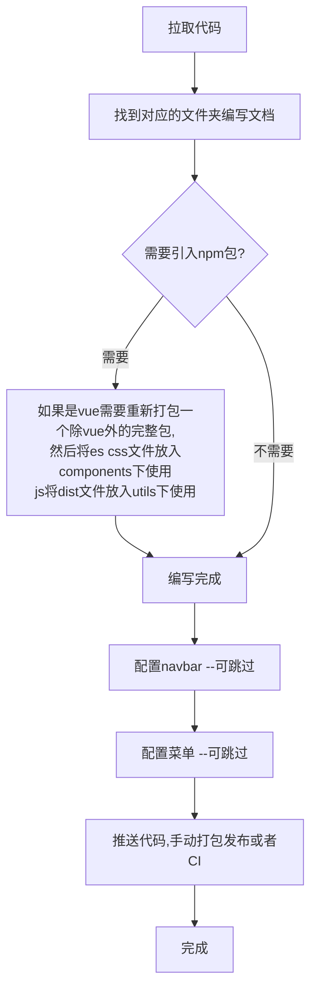

<template v-slot:right>

# 📝 使用方式

- 使用前可以先阅读[注意事项](https://ynqq.github.io/doc/note/)，这里有一些模块和对应的代码可以参考。
- navbar 配置
  > 配置文件地址: src\\.vuepress\navbar<a href="https://theme-hope.vuejs.press/zh/guide/interface/icon.html#%E6%B5%8F%E8%A7%88%E5%9B%BE%E6%A0%87" target="_">内置 iconfont 图标</a>

```json
{
  "text": "navbar名称",
  "icon": "图标",
  "link": "/v3/(src/文件地址,不写具体md就会使用README.md当做首页)"
}
```

- 菜单配置
  > vuepress-theme-hope 在 sidebar 中配置"structure"会根据目录结构自动生成菜单，该 navbar 下的 md 文件如果有文件夹会生成多层级的菜单，如果在最外层则生成一级菜单。

</template>
  <template v-slot:default>

# 🛠 使用流程

<Transform :scale=0.45>

</Transform>

</template>
